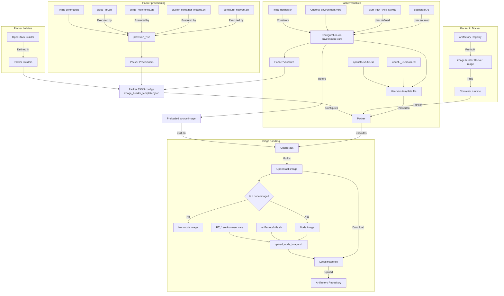

# Generating images

## Images

The images used in the CI :

* Jenkins Ubuntu image

* Base Ubuntu image
* Metal3 Ubuntu image

* Base CentOS image
* Metal3 CentOS dev-env image
* Metal3 CentOS node image

### Base

 This is a vanilla ubuntu with some handy tools and user configuration

### Jenkins

 This image includes a JDK

### Metal3

 This image includes the packages needed to run the Metal3 dev env.

## Requirements

You need to have the environmental variables set to access Openstack, for
example with :

   ```bash
      source openstack.rc
   ```

You need to have the Metal3 CI user private key.

### Building environment

A container image is available and contains all the tools to build the images

   ```bash
      docker pull registry.nordix.org/metal3/image-builder
   ```

   ```bash
      docker run --rm -it -v "<path to metal3-dev-tool repo>:/data"
   -v "<path to ci keys folder>:/data/keys" registry.nordix.org/metal3/image-builder /bin/bash
   ```

### Calling the scripts

First, you will need to source the OpenStack credentials file.

   ```bash
      source openstack.rc
   ```

Then set the correct environment variables:

   ```bash
      export METAL3_CI_USER=metal3ci
      export METAL3_CI_USER_KEY=/data/keys/id_ed25519_metal3ci
      export RT_URL="https://artifactory.nordix.org/artifactory"
   ```

The ubuntu building scripts take two arguments :

* path: to metal3 CI private key relative in the container
* boolean: Use a floating ip publicly accessible ( 0 or 1 )

   ```bash
   ./gen_<xxx>_<ubuntu>_image.sh /data/keys/id_ed25519_metal3ci 1
   ```

The centos building scripts take three arguments :

* path: to metal3 CI private key relative in the container
* boolean: Use a floating ip publicly accessible ( 0 or 1 )
* provisioner script: script file name, give random string to list available scripts

   ```bash
   ./gen_<xxx>_<centos>_image.sh /data/keys/id_ed25519_metal3ci 1 <provisioner script>
   ```

### Building and testing locally

The scripts mentioned above (gen_*_image.sh) are made for use in our CI pipelines.
As such, they make certain assumptions that may not be ideal when developing and testing things locally (e.g. keypair name and ssh-key path).

For these situations there is another script: `run_local.sh`.
It allows overriding many variables so it should be easy to customize to your needs.

This is how you use it:

0. Create an ssh key using `ssh-keygen` if you don't have one already and add it to openstack: `openstack keypair create --public-key /path/to/key <name>`.
1. Check the comments and variables at the top of `run_local.sh` and determine what you want/need to override.
2. Create a file with your custom variables.
3. Get an openstack.rc file with credentials to the cloud you want to build in.
4. Source your variables, source the openstack.rc.
5. Run the script: `./run_local.sh <provisioning-script>`

Here is an example of custom variables:

```bash
# My custom variables
export PACKER_SSH_USER_NAME="foo"
export USERDATA_SSH_PUBLIC_KEY_FILE="/home/foo/.ssh/id_rsa.pub"
export PACKER_SSH_PRIVATE_KEY_FILE="/home/foo/.ssh/id_rsa"
export IMAGE_NAME="foo-test-image"
export SOURCE_IMAGE_NAME="Upstream-centos-or-ubuntu"
# Openstack network name, vm will receive Openstack internal IP from this network.
export OS_NETWORK_NAME="ext-net"
# If user wants to use Openstack network ID instead of the network name,
# then this variable can be set this instead (then network ID lookup won't happen):
export OS_NETWORK_ID="abcdefg"
# Artifactory variables
# These are needed if you want to build Node images and upload them to Artifactory
export RT_URL="https://artifactory.nordix.org/artifactory"
export RT_USER=<your-username>
export RT_TOKEN=<your-token>
```

**NOTE:** The script uploads the node images (i.e. those produced by `provision_node_image_ubuntu.sh` and `provision_node_image_centos.sh`) to Artifactory.
Make sure you use an image name that does not conflict with existing images!
This is also a good idea for other images since they will end up in Openstack.

Additional configuration options:
```bash
export PACKER_DEBUG_ENABLED="true/false" # if true runs the packer build in interactive debug mode,
                                         # packer stops between build stages
export IMAGE_CLEANUP="true/false" # if true deletes the image from openstack that has an equivalent
                                  # name with the one specifed in the IMAGE_NAME variable, if false doesn't delete any image,
                                  # instead appends a timestamp to the name of each newly built image to avoid collision
```

If the the `./run_local sandbox` command is issued the packer build and the artifactory upload process
won't be executed, rather the user will be presented with an interactive container environment where
the openstack cli can be used to check the openstack resources.

And here is how to use it:

```bash
source vars.sh
source openstack.rc
./run_local.sh provision_metal3_image_ubuntu.sh
```

**Remember to clean up the images when you no longer need them!**

#### Manual upload to Artifactory

You can use the `upload_node_image_rt.sh` script to upload the images to Artifactory.
For this you will need to set some environment variables:

```bash
export RT_URL="https://artifactory.nordix.org/artifactory"
export RT_USER=<your-username>
export RT_TOKEN=<your-token>
../scripts/image_scripts/upload_node_image_rt.sh "${IMAGE_NAME}"
```

The script will automatically download the image from Openstack and upload it to the `metal3/images/k8s_${KUBERNETES_VERSION}` folder.

#### Clean up images

List and delete images in Artifactory:

```bash
export RT_URL="https://artifactory.nordix.org/artifactory"
source ../scripts/artifactory/utils.sh
rt_list_directory "metal3/images"
rt_list_directory "metal3/images/k8s_v1.28.1"

# Please check carefully the path and name before deleting.
# Note that you need to add the suffix ".qcow2" here.
export RT_USER=<your-username>
export RT_TOKEN=<your-token>
rt_delete_artifact "metal3/images/k8s_v1.28.1/${IMAGE_NAME}.qcow2" "0"
```

List and delete images in Openstack:

```bash
source openstack.rc
openstack image list
openstack image delete ${IMAGE_NAME}
```

## Packer image build flow

This describes the flow of configuration and invocation of scripts in order to build an image with `run_local.sh`. This flow matches `provision_metal3_image_ubuntu.sh` provisioning.

Requirements for the build are:

* `openstack.rc` from an OpenStack instance
* `SSH_KEYPAIR_NAME` for pre-created SSH keypair in OpenStack
* Docker or other `CONTAINER_RUNTIME` installed
* Access to `registry.nordix.org` Docker registry for `image-builder` image
* OpenStack needs to have source image preloaded
* Write access to `artifactory.nordix.org` for node image upload after build


