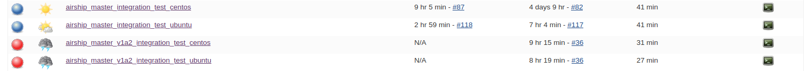

### Access to Nordix Jenkins
You can access to Nordix [Jenkins](https://jenkins.nordix.org/view/Airship/)
with your Google account.

###  Daily steps to ensure successfullness of Jenkins CI

**Note: you can run 'jenkins-check-ci.sh' script to check job statuses**
* jenkins-jobs-to-scan.txt lists string patterns used for checking

Check global status of jobs which are built on a daily basis:
* [airship_master_integration_test_centos](https://jenkins.nordix.org/view/Airship/job/airship_master_integration_test_centos/) *(v1alpha1 integration test)*
* [airship_master_integration_test_ubuntu](https://jenkins.nordix.org/view/Airship/job/airship_master_integration_test_ubuntu/) *(v1alpha1 integration test)*
* [airship_master_v1a2_integration_test_centos](https://jenkins.nordix.org/view/Airship/job/airship_master_v1a2_integration_test_centos/) *(v1alpha2 integration test)*
* [airship_master_v1a2_integration_test_ubuntu](https://jenkins.nordix.org/view/Airship/job/airship_master_v1a2_integration_test_ubuntu/) *(v1alpha2 integration test)*
* [airship_master_v1a3_integration_test_centos](https://jenkins.nordix.org/view/Airship/job/airship_master_v1a3_integration_test_centos/) *(v1alpha3 integration test)*
* [airship_master_v1a3_integration_test_ubuntu](https://jenkins.nordix.org/view/Airship/job/airship_master_v1a3_integration_test_ubuntu/) *(v1alpha3 integration test)*
* [airship_openstack_image_building](https://jenkins.nordix.org/view/Airship/job/airship_openstack_image_building/)
* [airship_docker_image_building](https://jenkins.nordix.org/view/Airship/job/airship_docker_image_building/)
* [airship_nordix_dev_tools_repos](https://jenkins.nordix.org/view/Airship/job/airship_nordix_dev_tools_repos/)

Jobs with prefix 'airship_master_' run metal3-dev-env v1alpha1, v1alpha2 and v1alpha3 integration tests. You
should see blue colour that indicates that run was successfull.



In case of job **FAILURE**,
 - first check the job's logs (```console output```) to get more info.
 - check what are the PRs that were merged last time, which could potentially
 cause CI failure.


### Some of common causes of failure that you might encounter
* ``` E: Could not get lock /var/lib/dpkg/lock-frontend - open (11: Resource temporarily unavailable) ```
* ```"Unable to connect to the server: dial tcp 192.168.39.150:8443: connect: no route to host```
* ```"Error from server: error when creating "STDIN": etcdserver: request timed out"```
* ```Failed due to timeout``` - sometimes job might fail because of the timeout
which could happen due to slowleness of CityCloud infrastructure.

### How to resolve the above failures
Just trigger the CI manually because these causes aren't results of any pull
request but rather system instability.

### Possible sources of notifications on CI failures
* First place to notice the CI failure is [Nordix Jenkins UI](https://jenkins.nordix.org/view/Airship/)
* Metal3 [Slack channel](https://kubernetes.slack.com/messages/CHD49TLE7)
#cluster-api-baremetal
* Metal3 [Mailing list](https://groups.google.com/forum/#!forum/metal3-dev)


### Workflow of Nordix Jenkins CI
First based on a trigger-phrase from an open PR or on a daily basis, Jenkins Job
Builder (JJB) builds a Jenkins CI job, which will execute the steps given in
the corresponding pipeline (example: [capi_bm_integration_tests.pipeline](https://github.com/Nordix/airship-dev-tools/blob/master/ci/jobs/capi_bm_integration_tests.pipeline))

**Note:** You will find JJB files in [Nordix Gerrit](https://gerrit.nordix.org/admin/repos/infra/cicd)
and Jenkins pipelines in [airship-dev-tools](https://github.com/Nordix/airship-dev-tools/tree/master/ci/jobs).

When a job is triggered either by trigger-phrase or on a daily basis, it is executed in
one of the Jenkins slave VM (example:```airship-static0-workers-*```), which is
 running on **Default_Project_37137** of [City Cloud](https://citycontrolpanel.com/landing?m=login_required).

In order to access the VM where the job is running:
1. Find the name of the Jenkins slave (from [Jenkins](https://jenkins.nordix.org/view/Airship/))
that is executing the job.
2. Go the [City Cloud](https://citycontrolpanel.com/landing?m=login_required)
console and get the floating IP of the corresponding Jenkins slave VM.
3. Find the IP of the VM  from Jenkins job's **console_output**, which is
created for running actual integration test. See example screenshot:


4. SSH into the Jenkins slave VM with its floating IP that you found in step2
and from there SSH into the actual tester VM with its own IP that you found
in step3.

  **Note:** to SSH the Jenkins slave VM you need an airshipci SSH key

5. Once you are inside the tester VM you can debug it and get more info.  
